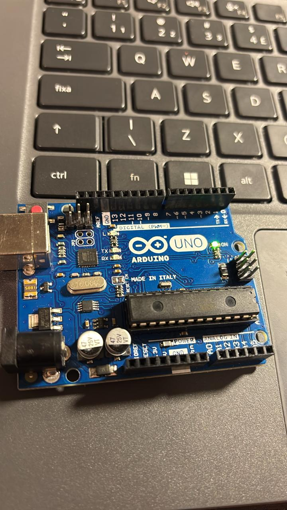
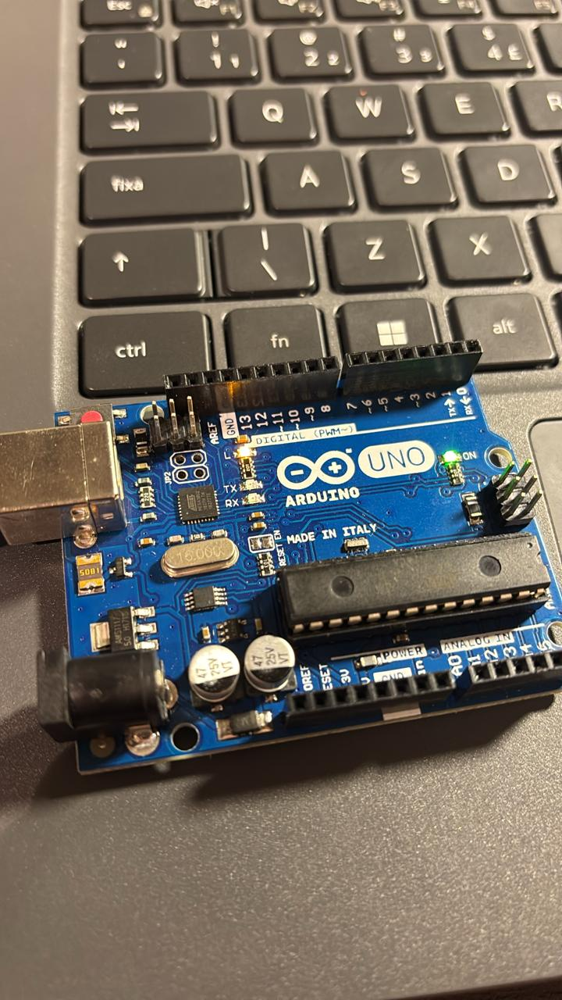
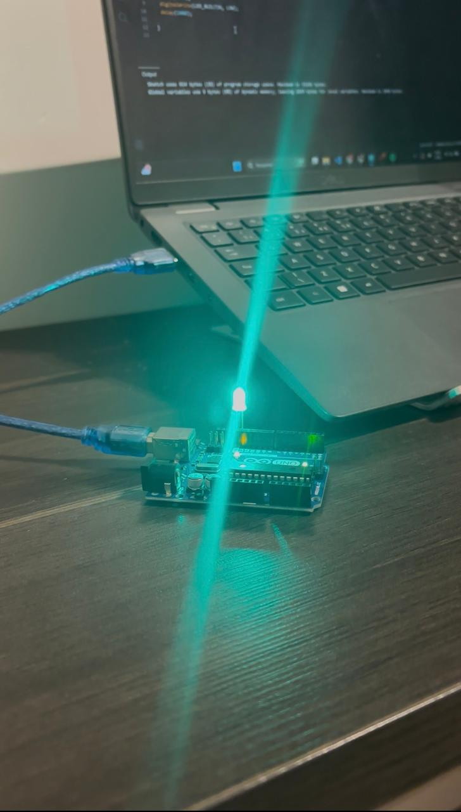
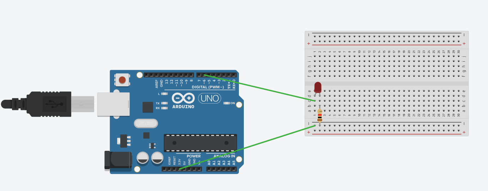

  

## Parte 1 - LED

No primeiro momento, o objetivo foi aprender a controlar o LED interno do Arduino, fazendo-o acender e apagar de forma contínua, criando um efeito de "luz piscando" (blink).

### Componentes utilizados
- Arduino Uno

- Cabo USB para conexão com o computador

- Computador com Arduino IDE instalada

Segue a imagem de demonstração:

### LED interno apagado

### LED interno aceso

[ Clique aqui para ver o vídeo de demonstração](assets/video2.mp4)

Além do LED interno, adicionei um LED externo ao projeto para aprofundar o aprendizado sobre o controle de pinos digitais no Arduino. Com isso, além de controlar o LED interno da placa, agora também é possível acender e apagar um LED conectado externamente

### LED externo

[ Clique aqui para ver o vídeo de demonstração](assets/video.mp4)

## Parte 2

Nesta etapa, foi realizada a simulação do circuito no TinkerCad.
O circuito foi montado com um LED externo (OFF_BOARD), conectado ao pino digital 6 do Arduino, utilizando um resistor para limitar a corrente elétrica e proteger o LED.

### Componentes utilizados
Arduino Uno: microcontrolador responsável por enviar os sinais elétricos que acendem e apagam o LED conforme o código.

Protoboard: placa usada para conectar os componentes eletrônicos sem necessidade de solda.

LED: componente emissor de luz que acende e apaga de acordo com os comandos do Arduino.

Resistor: limita a corrente elétrica que passa pelo LED, evitando que ele queime.

Jumpers: fios utilizados para realizar as conexões entre o Arduino e o protoboard.

Simulação feita no TinkerCad com LED.

🔗 [Ver projeto no TinkerCad](https://www.tinkercad.com/things/d1yCmj3y2m4-copy-of-fabulous-lappi-hango?sharecode=RxoQIzwBeu4lNFtD3A4ueFK_J3Qy0REiZEHDNT5YCQE)
